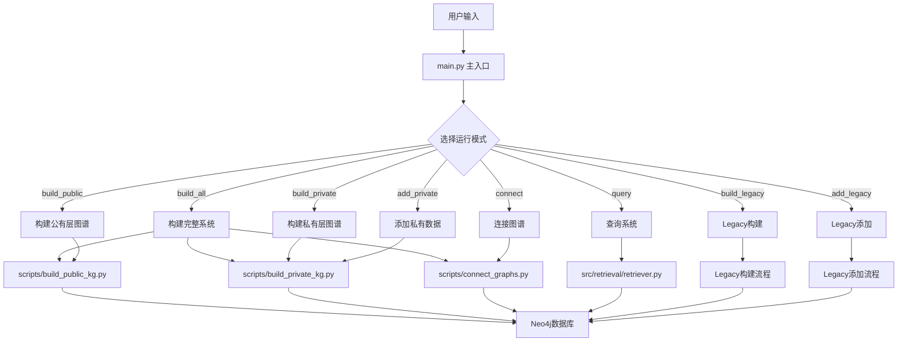
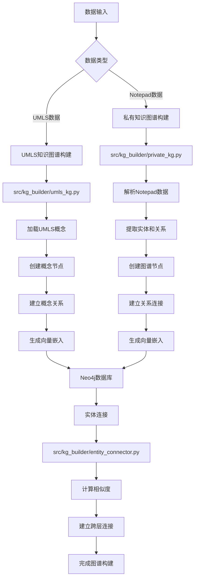
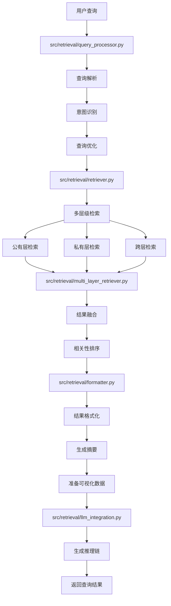
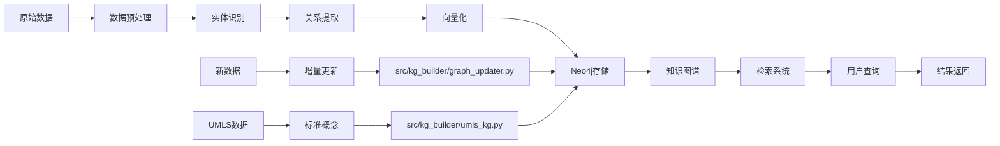

# 医疗知识图谱系统

基于Neo4j和UMLS的医疗知识图谱检索系统，支持多层级检索、动态图谱更新和智能推理。

## ⚠️ 重要说明

**API功能目前处于开发阶段，未来会拓展这部分的代码，提供的代码仅供参考。**

本系统主要提供以下核心功能：
- 多层级知识图谱构建（公有层 + 私有层）
- 智能检索和推理
- 动态图谱更新
- 模块化设计
- 实体关联和跨层推理

## 功能特性

- **多层级知识图谱**: 集成私有医疗数据和UMLS标准医疗概念
- **智能检索**: 支持语义检索、推理链生成和置信度计算
- **动态更新**: 支持增量添加新的医疗数据到现有图谱
- **模块化设计**: 清晰的代码结构，易于维护和扩展
- **命令行工具**: 提供完整的命令行接口进行图谱操作
- **实体关联**: 自动发现和建立跨层实体关联关系
- **向量化检索**: 基于SapBERT的医疗文本向量化
- **LLM集成**: 支持Ollama本地大语言模型推理

## 技术栈

### 核心技术
- **数据库**: Neo4j 图数据库
- **向量化**: SapBERT (cambridgeltl/SapBERT-from-PubMedBERT-fulltext)
- **大语言模型**: Ollama (支持多种开源模型)
- **Python框架**: FastAPI (API开发)
- **数据处理**: Pandas, NumPy
- **机器学习**: PyTorch, Transformers

### 依赖库
- `neo4j`: Neo4j数据库驱动
- `sentence-transformers`: 文本向量化
- `transformers`: Hugging Face模型库
- `torch`: PyTorch深度学习框架
- `fastapi`: Web API框架
- `pydantic`: 数据验证
- `python-dotenv`: 环境变量管理

## 项目目录架构

```
healthcare-modeling/
├── main.py                 # 主入口文件
├── README.md              # 项目说明文档
├── requirements.txt       # Python依赖包
├── pyproject.toml         # 项目配置文件
├── .gitignore            # Git忽略文件
├── data/                 # 数据目录
│   ├── notepad.txt       # Notepad数据文件
│   ├── umls/            # UMLS数据目录
│   └── srdef            # SRDEF文件
├── logs/                 # 日志目录
├── scripts/              # 脚本目录
│   ├── build_public_kg.py    # 构建公有层图谱
│   ├── build_private_kg.py   # 构建私有层图谱
│   ├── connect_graphs.py     # 连接图谱
│   ├── setup_database.py     # 数据库初始化
│   ├── run_retrieval.py      # 运行检索系统
│   ├── add_data.py           # 添加数据
│   ├── manage.py             # 系统管理
│   └── start_api.py          # 启动API服务
├── src/                  # 源代码目录
│   ├── __init__.py
│   ├── api/              # API接口模块
│   │   ├── __init__.py
│   │   └── endpoints.py  # FastAPI端点
│   ├── config/           # 配置管理模块
│   │   ├── __init__.py
│   │   └── settings.py   # 系统配置
│   ├── core/             # 核心功能模块
│   │   ├── __init__.py
│   │   ├── database.py   # 数据库管理
│   │   ├── embeddings.py # 向量化处理
│   │   └── models.py     # 数据模型
│   ├── kg_builder/       # 知识图谱构建模块
│   │   ├── __init__.py
│   │   ├── private_kg.py      # 私有知识图谱
│   │   ├── umls_kg.py         # UMLS知识图谱
│   │   ├── entity_connector.py # 实体关联
│   │   └── graph_updater.py   # 动态图谱更新
│   ├── retrieval/        # 检索系统模块
│   │   ├── __init__.py
│   │   ├── retriever.py           # 主检索器
│   │   ├── query_processor.py     # 查询处理
│   │   ├── formatter.py           # 结果格式化
│   │   ├── identifier.py          # 实体识别
│   │   ├── llm_integration.py     # LLM集成
│   │   ├── multi_layer_retriever.py # 多层级检索
│   │   └── cross_layer_connector.py # 跨层连接
│   └── utils/            # 工具模块
│       ├── __init__.py
│       ├── config.py         # 配置工具
│       ├── file_processor.py # 文件处理
│       ├── logging_config.py # 日志配置
│       └── text_processor.py # 文本处理
```

## 系统架构

### 核心组件

```
src/
├── core/                    # 核心模块
│   ├── database.py         # 数据库管理
│   ├── embeddings.py       # 向量化处理
│   └── models.py          # 数据模型
├── kg_builder/             # 知识图谱构建
│   ├── private_kg.py      # 私有知识图谱
│   ├── umls_kg.py         # UMLS知识图谱
│   ├── entity_connector.py # 实体关联
│   └── graph_updater.py   # 动态图谱更新
├── retrieval/              # 检索系统
│   ├── retriever.py       # 多层级检索
│   ├── query_processor.py # 查询处理
│   ├── formatter.py       # 结果格式化
│   ├── identifier.py      # 实体识别
│   ├── llm_integration.py # LLM集成
│   ├── multi_layer_retriever.py # 多层级检索
│   └── cross_layer_connector.py # 跨层连接
├── api/                    # API接口
│   └── endpoints.py       # FastAPI端点
└── utils/                  # 工具模块
    ├── config.py          # 配置管理
    ├── file_processor.py  # 文件处理
    ├── logging_config.py  # 日志配置
    └── text_processor.py  # 文本处理
```

### 核心模块说明

#### 1. 知识图谱构建模块 (kg_builder/)
- **private_kg.py**: 构建基于Notepad数据的私有知识图谱
- **umls_kg.py**: 构建基于UMLS标准概念的公有知识图谱
- **entity_connector.py**: 建立跨层实体关联关系
- **graph_updater.py**: 支持动态图谱更新

#### 2. 检索系统模块 (retrieval/)
- **retriever.py**: 主检索器，协调多层级检索
- **multi_layer_retriever.py**: 实现公有层、私有层和跨层检索
- **query_processor.py**: 查询解析和意图识别
- **formatter.py**: 结果格式化和摘要生成
- **llm_integration.py**: 集成Ollama进行推理链生成

#### 3. 核心功能模块 (core/)
- **database.py**: Neo4j数据库连接和管理
- **embeddings.py**: 基于SapBERT的文本向量化
- **models.py**: 定义实体、关系和查询结果的数据模型

## 项目文件流程图

### 系统整体流程图


### 知识图谱构建流程图


### 检索系统流程图


### 数据流向图


## 安装和配置

### 1. 环境要求

- Python 3.8+
- Neo4j 4.0+
- 8GB+ 内存推荐
- CUDA支持（可选，用于GPU加速）

### 2. 安装依赖

```bash
# 安装项目依赖
pip install -e .

# 安装PyTorch（根据您的CUDA版本选择）
pip install torch torchvision torchaudio --index-url https://download.pytorch.org/whl/cu118

# 安装transformers和sentence-transformers
pip install transformers sentence-transformers
```

### 3. 配置数据库

编辑 `src/config/settings.py` 或设置环境变量：

```python
NEO4J_URI = "bolt://localhost:7687"
NEO4J_USER = "neo4j"
NEO4J_PASSWORD = "your_password"
```

### 4. 配置模型

系统使用以下模型，需要预先下载：

```bash
# 设置环境变量
export EMBEDDING_MODEL="cambridgeltl/SapBERT-from-PubMedBERT-fulltext"
export OLLAMA_MODEL="gemma3:27b"  # 或其他支持的模型
export OLLAMA_URL="http://localhost:11434/api/generate"
```

### 5. 初始化数据库

```bash
python scripts/setup_database.py
```

## 快速开始

### 1. 一键构建完整系统

```bash
# 构建完整的知识图谱系统（推荐）
python main.py --mode build_all --notepad-file data/notepad.txt --hospital-number "12345"
```

### 2. 分步构建系统

```bash
# 步骤1: 构建公有层图谱
python main.py --mode build_public

# 步骤2: 构建私有层图谱
python main.py --mode build_private --notepad-file data/notepad.txt --hospital-number "12345"

# 步骤3: 连接图谱
python main.py --mode connect --similarity-threshold 0.6
```

### 3. 开始检索

```bash
# 交互式检索
python scripts/run_retrieval.py --interactive

# 直接查询
python main.py --mode query --query "患者Lin的实验室检查结果"
```

## 使用方法

重点关注：公有层图谱、私有层图谱的构建、私有层图谱的数据更新、检索几个功能。

### 1. 构建公有层知识图谱

公有层图谱基于UMLS标准医疗概念构建，提供标准化的医疗知识基础。

#### 使用main.py构建
```bash
# 仅构建公有层图谱
python main.py --mode build_public
```

#### 使用脚本构建
```bash
# 使用脚本构建公有层图谱
python scripts/build_public_kg.py
```

### 2. 构建私有层知识图谱

私有层图谱基于具体的医疗数据（Notepad格式）构建，包含患者、症状、诊断等具体信息。

#### 使用main.py构建
```bash
# 构建私有层图谱
python main.py --mode build_private --notepad-file data/notepad.txt --hospital-number "12345"

# 清除现有数据后构建
python main.py --mode build_private --notepad-file data/notepad.txt --hospital-number "12345" --clear-existing
```

#### 使用脚本构建
```bash
# 使用脚本构建私有层图谱
python scripts/build_private_kg.py --mode build --notepad-file data/notepad.txt --hospital-number "12345"
```

### 3. 跨图谱链接

连接公有层和私有层图谱，建立语义关联，实现跨层推理。

#### 使用main.py连接
```bash
# 使用默认相似度阈值连接
python main.py --mode connect

# 使用自定义相似度阈值连接
python main.py --mode connect --similarity-threshold 0.6
```

#### 使用脚本连接
```bash
# 使用脚本连接图谱
python scripts/connect_graphs.py --similarity-threshold 0.6
```

### 4. 检索功能

提供智能检索和推理功能，支持多层级检索和推理链生成。

#### 使用main.py检索
```bash
# 命令行查询
python main.py --mode query --query "患者Lin的实验室检查结果"
```

#### 使用脚本检索
```bash
# 交互式查询
python scripts/run_retrieval.py --interactive

# 直接查询
python scripts/run_retrieval.py --query "患者Lin的实验室检查结果"
```

### 5. 完整系统构建

一次性构建完整的知识图谱系统（公有层 + 私有层 + 连接）。

```bash
# 构建完整系统
python main.py --mode build_all --notepad-file data/notepad.txt --hospital-number "12345"

# 使用自定义相似度阈值
python main.py --mode build_all --notepad-file data/notepad.txt --hospital-number "12345" --similarity-threshold 0.6
```

### 6. 数据管理

#### 添加新数据
```bash
# 添加新数据到私有图谱
python main.py --mode add_private --notepad-file data/new_data.txt --hospital-number "12345"

# 使用脚本添加数据
python scripts/add_data.py --notepad-file data/new_data.txt --hospital-number "12345"
```

#### 使用Legacy模式
```bash
# Legacy模式构建
python main.py --mode build_legacy --notepad "notepad_content" --hospital-number "12345"

# Legacy模式添加数据
python main.py --mode add_legacy --notepad "notepad_content" --hospital-number "12345"
```

## 命令行模式说明

### 主要运行模式

- `build_all` - 构建完整知识图谱系统（公有层 + 私有层 + 连接）
- `build_public` - 仅构建公有层图谱
- `build_private` - 仅构建私有层图谱
- `add_private` - 添加新数据到私有层图谱
- `connect` - 连接公有层和私有层图谱
- `query` - 查询知识图谱
- `build_legacy` - 使用旧的构建系统
- `add_legacy` - 使用旧的添加数据系统

## 配置说明

### 环境变量

```bash
# 数据库配置
export NEO4J_URI="bolt://localhost:7687"
export NEO4J_USER="neo4j"
export NEO4J_PASSWORD="your_password"

# 数据路径
export PDF_DIR="/path/to/pdf/files"
export UMLS_DATA_DIR="/path/to/umls/data"
export SRDEF_PATH="/path/to/srdef"

# 模型配置
export OLLAMA_MODEL="gemma3:27b"
export OLLAMA_URL="http://localhost:11434/api/generate"
export EMBEDDING_MODEL="cambridgeltl/SapBERT-from-PubMedBERT-fulltext"

# 检索配置
export SIMILARITY_THRESHOLD="0.6"
export MAX_RESULTS="10"
export CONFIDENCE_THRESHOLD="0.7"
```

### 配置文件

主要配置在 `src/config/settings.py` 中，支持通过环境变量覆盖。

## 开发指南

### 添加新的实体类型

1. 在 `src/core/models.py` 中定义新的实体模型
2. 在相应的构建器中添加解析逻辑
3. 更新检索器的处理逻辑

### 添加新的关系类型

1. 在 `src/core/models.py` 中定义新的关系模型
2. 在构建器中添加关系创建逻辑
3. 更新检索器的关系处理

### 扩展检索功能

1. 在 `src/retrieval/retriever.py` 中添加新的检索方法
2. 更新 `QueryResult` 模型以包含新信息
3. 在命令行接口中添加新的查询选项

## 故障排除

### 常见问题

1. **数据库连接失败**
   - 检查Neo4j服务是否运行
   - 验证连接参数是否正确
   - 确保防火墙允许7687端口

2. **内存不足**
   - 减少批处理大小
   - 增加系统内存
   - 使用GPU加速（如果可用）

3. **模型加载失败**
   - 检查网络连接
   - 验证模型名称是否正确
   - 确保有足够的磁盘空间下载模型

4. **检索结果为空**
   - 确保已构建公有层和私有层图谱
   - 检查实体连接是否完成
   - 验证查询语句是否正确

5. **Ollama连接失败**
   - 确保Ollama服务正在运行
   - 检查OLLAMA_URL配置是否正确
   - 验证模型是否已下载

### 日志

系统日志级别可通过 `LOG_LEVEL` 环境变量设置：
- DEBUG: 详细调试信息
- INFO: 一般信息（默认）
- WARNING: 警告信息
- ERROR: 错误信息

## 许可证

本项目采用MIT许可证。

## 贡献

欢迎提交Issue和Pull Request来改进项目。

## 更新日志

### v2.1.0 (当前版本)
- 修复检索器模块导入问题
- 完善实体关联功能
- 优化多层级检索性能
- 增强错误处理和日志记录
- 改进命令行接口用户体验
- 添加向量化检索支持
- 集成Ollama本地LLM推理

### v2.0.0
- 完全重构代码架构
- 添加动态图谱更新功能
- 改进模块化设计
- 增强错误处理和日志记录
- 优化命令行接口
- 添加进度提示和用户友好的输出

### 未来计划
- 开发完整的RESTful API接口
- 添加Web界面
- 支持更多数据格式
- 增强推理能力
- 添加实时图谱可视化
- 支持多语言医疗文本处理
